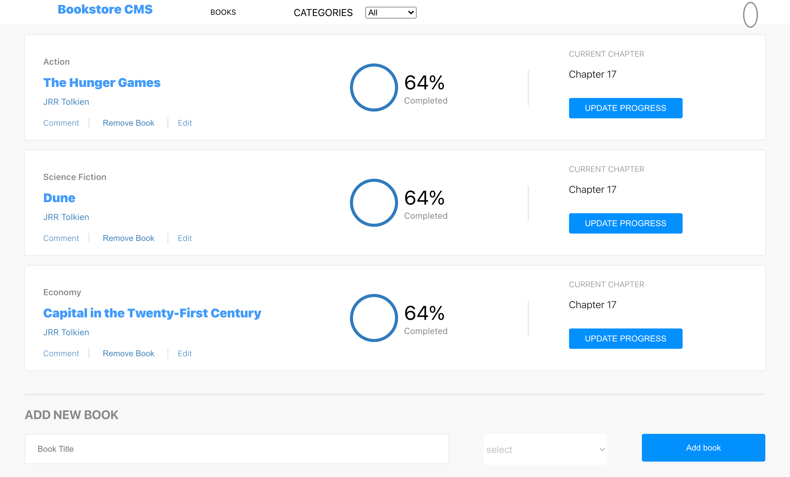

# book-store

This is the first Milestone of the project Bookstore from the React and Redux module from Microvers. This Milestone goal is to give the style to the SPA following a given example.

## :hammer: Built with:

- Html
- Css
- JavaScript
- React
- Redux

## :red_circle: Live Demo:

[Live demo](https://react-my-book-store.herokuapp.com/)

## :construction_worker: Getting Started

To get a local copy up and running follow these simple steps:

- Go to the main page.
- Press the "Code" button and get the repo link.
- Clone it using git command "git clone".
- Open in terminal the folder just cloned.
- run in terminal 'npm install'.
- To see locally run 'npm run start'.

👤 **Mir Rawshan Ali**

- GitHub: [@sumon0002009](https://github.com/sumon0002001)
- Twitter: [@sumon0002009](https://twitter.com/Sumon0002009)
- LinkedIn: [Mir Rawshan Ali](https://www.linkedin.com/in/mir-rawshan-ali/)

## :raised_hand: :raised_hand: Contributions

Contributions, issues and feature requests are welcome!

Feel free to check the [issues here]().

## Show your support

Give a :star: if you like this project!.

## :grey_exclamation: Acknowlegment

- To [Microverse](https://www.microverse.org/)
- Mentor.
- Stand up team

## :memo: License

This project is [MIT](LICENSE) licensed.
